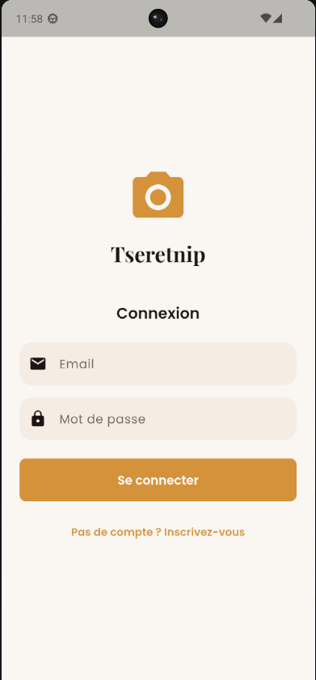
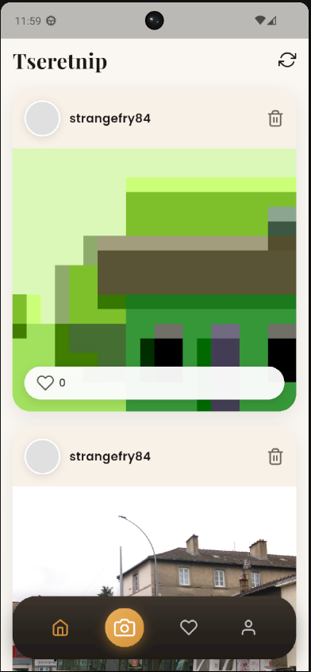
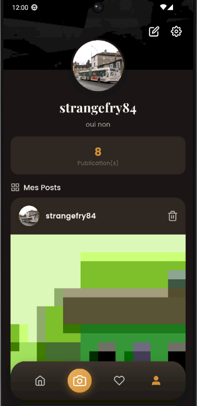
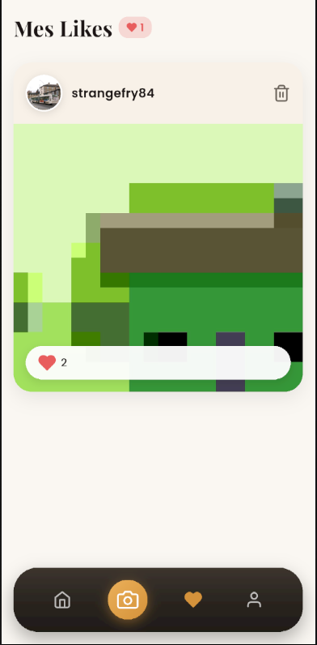
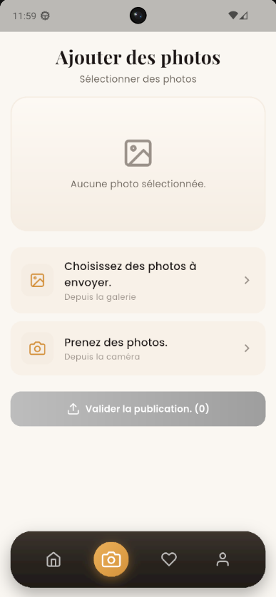

# tseretnip

## 👥 Équipe
- Louis Potevin (louis1.potevin1@gmail.com)
- Ethan Manchon (ethan.manchon@etu.unilim.fr)
- William Brooks (william.brooks@etu.unilim.fr)

## 📱 Description
Tseretnip est une application mobile de partage de photos permettant de publier des images (depuis la caméra ou la galerie), consulter un fil d’actualité et supprimer ses publications. Elle intègre une gestion complète des comptes (inscription/connexion) ainsi qu’un profil utilisateur regroupant les posts et des réglages comme le thème clair/sombre. Les utilisateurs peuvent liker des posts et retrouver toutes leurs publications likées, avec une logique métier autour de la mise en avant des contenus (ex. classement selon popularité/récence). L’application propose aussi une interface soignée avec animations, internationalisation (2 langues) et l’usage de packages comme Lottie et flutter_svg, le tout connecté à un stockage persistant (Supabase).

## 🎯 Orientation choisie
Équilibrée

## ✅ Contraintes respectées
- ✅ Design basé sur un template mobile Dribbble (avec lien dans le README)
- ✅ Utilisation d'images (assets locaux ou réseau) de manière cohérente
- ✅ Mise en place de i18n (internationalisation) avec au moins 2 langues
- ✅ Intégration d'animations (Hero, AnimatedContainer, Lottie, etc.)
- ✅ Gestion du thème avancé avec mode light et dark (switch dans paramètres, sauvegarde de la préférence, toute l'app s'adapte)

- ✅ Un aspect métier fort avec logique complexe (calculs, algorithmes, workflows)
- ✅ Utilisation de stockage persistant (local avec SharedPreferences/Hive/SQLite ou Firebase/Supabase)
- ✅ Intégration d'au moins un package de pub.dev (hors stockage) pertinent pour votre métier
- ✅ Consommation d'une API (publique, créée par vous, ou utilisation de Firebase/Supabase)

## 🚀 Installation
```bash
git clone https://github.com/P2Wdisabled/tseretnip.git
cd tseretnip
flutter pub get
flutter run --dart-define-from-file=config.json
```

## 📸 Screenshots







## 🎥 Vidéo de démonstration
[Démonstration Tseretnip](https://www.youtube.com/shorts/b667bcaxbmE)

## 🎨 Design (si applicable)
- [Benchmark — Dribbble template](benchmark/dribble.png)
- [Benchmark — ChatGPT (image générée pour la page ajout de photos à partir du template Dribbble)](benchmark/ChatGPT.png)

## 📝 Difficultés rencontrées
La connexion à la base de données et l’implémentation de l’authentification ont été des points complexes du projet, en particulier la gestion des providers d’authentification et de l’état de connexion de l’utilisateur dans Flutter.
L’ajout des photos a également représenté une difficulté, en particulier le passage d’un stockage en Base64 à l’utilisation des buckets de stockage Supabase, plus adaptés à la gestion de fichiers.
